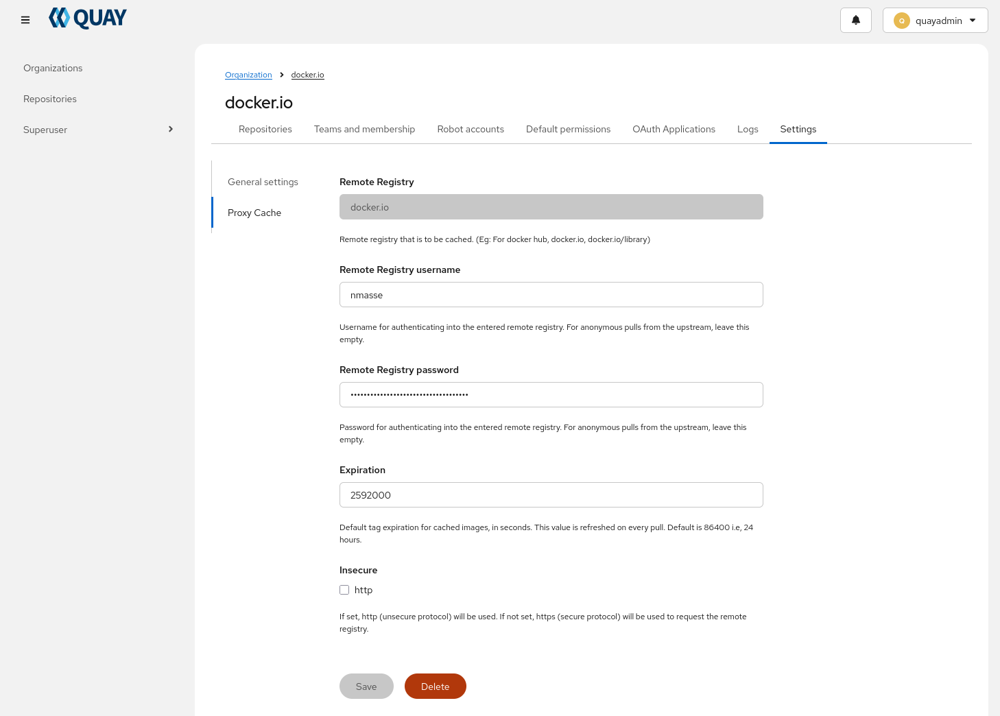

# Podman Quadlet: Quay Container Registry

## Overview

Quay is a self-hosted container registry started as a Podman Quadlet. It provides image storage, vulnerability scanning, repository mirroring, and proxy caching.

This cookbook runs a complete Quay stack:

- **quay-app**: The main Quay container registry application.
- **quay-clair**: Clair vulnerability scanner running in combo mode (indexer + matcher + notifier).
- **quay-init-certificate**: Initializes TLS certificates before Quay starts.
- **quay-load-renewed-certificate**: Reloads TLS certificates after Lego renewal.

This cookbook uses PostgreSQL as the database backend (requires the `postgresql` cookbook), Redis for caching (requires the `redis` cookbook), and Lego for TLS certificate management (requires the `lego` cookbook).

## Prerequisites

- The `postgresql` cookbook must be installed and running.
- The `redis` cookbook must be installed and running.
- The `lego` cookbook must be installed and running.
- The Quay database and user must be created in PostgreSQL (see `other/postgresql/quay.sh`).
- The Clair database and user must be created in PostgreSQL (see `other/postgresql/clair.sql`).
- The Redis ACL for Quay must be configured (see `other/redis/quay.acl`).
- The nftables firewall rules must be applied (see `other/nftables/50-quay.nft`).
- Configuration file `/etc/quadlets/quay/app/config.yaml` must exist (see `config/examples/app/config.yaml`).
- Configuration file `/etc/quadlets/quay/clair/config.yaml` must exist (see `config/examples/clair/config.yaml`).

## Usage

In a separate terminal, follow the logs.

```sh
sudo make tail-logs
```

Install the Podman Quadlets and start Quay.

```sh
sudo make clean install
```

You should see the services starting in order:

1. **quay-init-certificate.service** copies or generates TLS certificates.
2. **quay-clair.service** starts the Clair vulnerability scanner.
3. **quay-app.service** starts the Quay registry application.

Access Quay at `https://127.0.0.1:8443/`.

### First login

Bootstrap the initial superuser account:

```sh
ADMIN_PASSWORD='ChangeMe!'
curl -vk -X POST https://localhost:8443/api/v1/user/initialize \
  -H 'Content-Type: application/json' \
  --data "{\"username\":\"quayadmin\",\"password\":\"${ADMIN_PASSWORD}\",\"email\":\"root@localhost\",\"access_token\":true}"
```

## Registry Mirroring

Create a dedicated organization for each registry you want to mirror. For example, to mirror Docker Hub:



Then, on your clients, create `/etc/containers/registries.conf.d/mirror.conf` with the following content:

```toml
[[registry]]
prefix = "docker.io"
location = "docker.io"

# Optional: block direct access to the original registry to force clients to use the mirror
blocked = true

[[registry.mirror]]
location = "quay.example.test/docker.io"

# Optional: allow insecure access to the mirror if it's using self-signed certificates or plain HTTP
insecure = true
```

You can verify the mirror is working by pulling an image:

```sh
sudo -i # Open a true session so that credentials are not cleared after each command
podman login -u quayadmin -p 'ChangeMe!' https://quay.example.test
podman pull docker.io/library/alpine:latest
```

The `docker.io/library/alpine` repository should appear in the Quay UI under the organization you created for Docker Hub.
The image will be cached in Quay after the first pull.

If you want to access Quay from Podman Quadlets or Systemd units, you need to store the credentials in `/etc/containers/auth.json`:

```sh
sudo REGISTRY_AUTH_FILE=/etc/containers/auth.json podman login -u quayadmin -p 'ChangeMe!' https://quay.example.test
```

And then, in your Quadlet file or Systemd unit, set the environment variable `REGISTRY_AUTH_FILE=/etc/containers/auth.json` so that Podman can find the credentials when pulling images from the mirror.

```ini
[Service]
Environment=REGISTRY_AUTH_FILE=/etc/containers/auth.json
```

As a regular user, configure the mirror in `~/.config/containers/registries.conf` instead of `/etc/containers/registries.conf`.
And use the following command to login and store credentials in `~/.config/containers/auth.json`:

```sh
REGISTRY_AUTH_FILE=~/.config/containers/auth.json podman login -u quayadmin -p 'ChangeMe!' https://quay.example.test
```

> ![warning]
> If you enable persistent storage for the credentials, it is safer to generate a read-only robot account in Quay for pulling images from the mirror, and restrict the scope of the credentials to just the mirror repository. This way, if the credentials are leaked, the damage is limited. And if you need to access other parts of the registry read-write, you can login with a regular user account.
> 
> ```
> REGISTRY_AUTH_FILE=~/.config/containers/auth.json podman login -u robot-account -p token https://quay.example.test/docker.io
> ```
> 
> And when needed, you can login with a regular user account for read-write access:
> 
> ```
> podman login -u regular-user -p token https://quay.example.test
> ```

